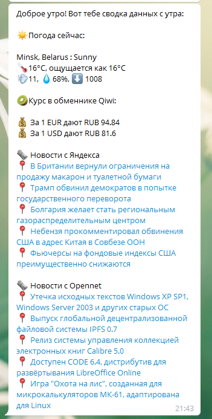

Проснулся утром и сразу полез залипать в смартфон, чтобы узнать несколько базовых (для меня) вещей: какая сегодня погода, че по курсам валют, какие новости, сколько входящих в почте. На всё это можно потратить достаточно времени, поэтому быстро было решено написать скрипт, который каждое утро отсылает всё это в одном сообщении.

# Представляю вам Morgenpost!

## Что умеет:
* Курс обмена валют c Qiwi
* Погода с Weatherstack
* Новости с RSS
* Отсылка в Telegram
* А ещё много чего, вы только пишите ишью и оставляйте пулреквесты, хоть иногда...

## Как заполнять конфиг
Да он и так отлично отдкументирован! Но если что...:
* Если где-то нужно ввести API KEY, а там пустая строка, то этот модуль использоваться не будет

## Как запускать
* Качаешь python 3.8 (я на нём тестил)
* Ставишь библиотечки через `pip3 install -r requirements.txt`
* Идешь в крон и запускаешь этот скрипт в время, когда ты можешь проснуться
* Profit!

## Как это выглядит
